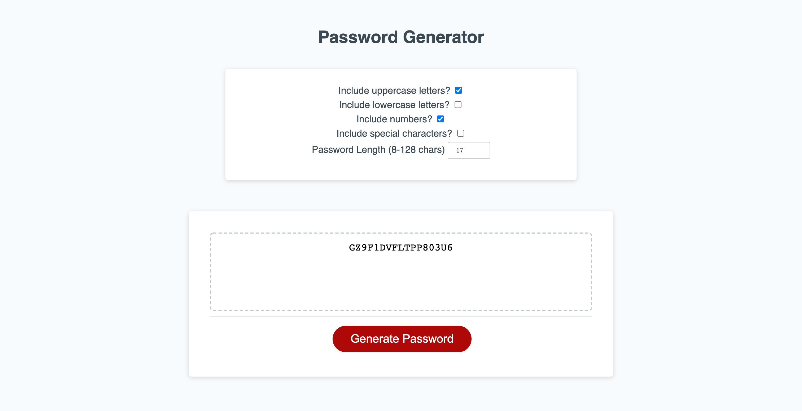

## Week 3 - Password Generator

For this weeks HW, I created a password generator using javascript. The user is presented with a form regarding different character types for password criteria.

After the user successfully fills the form, the generated password is displayed on the HTML page.

### Screenshot

